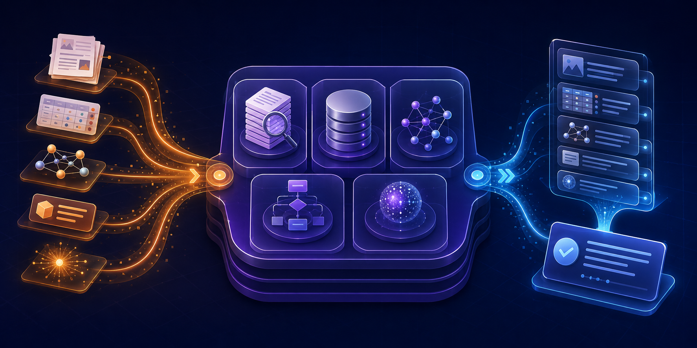

# DataMind

[English](./README.md) | **中文**

[](https://pypi.org/project/datamind/)
[](https://pypi.org/project/datamind/)
[](https://github.com/OpenDCAI/DataMind/blob/main/LICENSE)

面向 inference-time data 的双 agent 工具：**StoreAgent** 负责把数据自主路由到五个数据面，**RetrieveAgent** 只读地跨面取数、组合证据并回答问题。五个数据面是 RAG、数据库、图谱、Skills 和 Memory；系统不使用 DataOp、DataPlan 或执行 DAG。



*暖色路径表示 StoreAgent 的写入/入库流，冷色路径表示 RetrieveAgent 跨数据面读取证据并回答的流。*

> **v1.0.0 是 DataMind inference-time data plane 的首个稳定版本。** native 后端和本地 profile 工作流构成稳定核心；可选的 SDK/CCR 以及远程数据库集成仍建议先在你的环境中验证。当前代码位于 [`datamind/`](./datamind/) 目录；最初的 v0.1 原型（`main.py` / `server.py` / `modules/`）仅作对比参考而保留在仓库中。完整上手流程见 [`GETTING_STARTED.md`](./GETTING_STARTED.md) · [文档站](https://opendcai.github.io/DataMind-Doc/zh/)。

---

## 安装

```bash
pip install datamind
```

可选扩展：

```bash
pip install 'datamind[mysql]'         # MySQL 方言
pip install 'datamind[postgres]'      # PostgreSQL 方言
pip install 'datamind[voyage]'        # Voyage 向量嵌入
pip install 'datamind[huggingface]'   # 本地 BGE / e5 嵌入
pip install 'datamind[dev]'           # pytest + build + twine
```

指向 Anthropic 或 OpenAI Chat Completions 兼容网关即可开始对话：

```bash
export DATAMIND__LLM__API_BASE=https://your-gateway.example.com
export DATAMIND__LLM__API_KEY=sk-ant-...
export DATAMIND__LLM__PROTOCOL=anthropic  # 或 openai_chat_completions
export DATAMIND__LLM__MODEL=claude-sonnet-4-6

datamind chat                                          # 命令行
python -m uvicorn datamind.server:app --port 8000      # 浏览器界面 http://127.0.0.1:8000
```

所选协议会同时用于外层工具循环和内部生成（NL2SQL、multi-query、Memory、Graph
抽取）；模型名不会隐式决定协议。参见
[ADR 0001](./docs/adr/0001-protocol-neutral-model-clients.md)。

---

## 能力一览

| 数据面 | 后端 | RetrieveAgent | StoreAgent |
|---|---|---|---|
| **知识库（RAG）** | Chroma + BM25，采用倒数排名融合（RRF） | `kb_search`、`kb_list_documents`、`kb_count` | `kb_add_text`、`kb_add_file`、`kb_add_path`、`kb_reindex` |
| **图谱** | NetworkX，JSON 持久化 | `graph_search_entities`、`graph_traverse`、`graph_neighbors` | `graph_upsert_triples`、`graph_add_triples_from_text` |
| **数据库** | SQLAlchemy（SQLite / MySQL / Postgres） | `db_list_tables`、`db_describe_table`、`db_query_sql`、`db_query_nl` | `db_import_csv`、`db_import_records` |
| **技能（Skills）** | 基础 + profile 级 `SKILL.md`，以及安全的 Python 工具 | `skill_search`、`skill_get`、`skill_list`、`calculator`、`unit_convert`、`get_current_time`、`analyze_text` | `skill_upsert` |
| **记忆** | SQLite，余弦召回；按 `global` / `profile` / `session` 隔离 | `memory_recall`、`memory_list_profiles` | `memory_save`、`memory_forget` |

运行时使用两个物理隔离的注册表：RetrieveAgent 只有 19 个 read/utility 工具，StoreAgent 只有 11 个 write 工具。权限边界由代码强制执行，而不是依赖 prompt 自觉。

每次工具调用仍会经过共享的安全 HookChain：`PathAllowlistHook`、`DestructiveSqlHook` 和 `AuditLogHook`。

---

## 60 秒体验

> **只想直接用？** `pip install datamind`，设置 `DATAMIND__LLM__API_KEY`，运行 `datamind chat`。
> 下面的流程会克隆仓库，让你顺带拿到种子脚本和企业 demo 数据集。

```bash
git clone https://github.com/OpenDCAI/DataMind.git && cd DataMind
python -m venv .venv && source .venv/bin/activate
pip install -e .

cp .env.datamind.example .env.datamind
$EDITOR .env.datamind     # 至少设置 DATAMIND__LLM__API_KEY

# 1. 冒烟测试网关连通性（约 2 秒）
python -m datamind.scripts.hello_sdk

# 2. 灌入一个真实的企业数据集（17 篇文档 / 64 个图谱节点 / 6 张表 / 101 行）
python -m datamind.scripts.seed_enterprise_demo

# 3. 看 agent 自主回答 8 个跨后端的问题
DATAMIND__DATA__PROFILE=enterprise_demo \
  python -m datamind.scripts.hello_enterprise

# 4. 或者直接打开浏览器界面
DATAMIND__DATA__PROFILE=enterprise_demo \
  python -m uvicorn datamind.server:app --port 8000
# → http://127.0.0.1:8000  —— 把任意 .md / .csv / .txt 拖进拖拽区，提问，观察工具触发
```

更多细节见 [`GETTING_STARTED.md`](./GETTING_STARTED.md)；通用长跑评测接口、
checkpoint 格式与 resume 保证见 [`Benchmark runner`](./docs/BENCHMARK_RUNNER.md)。

---

## 这里的"agentic"到底指什么

问它：**「工程部 Shanghai 的员工工资加起来是多少？」**

RetrieveAgent 判断出需要用 SQL，先尝试 `db_query_nl`，拿到空结果后自己检查表结构并修正查询；关系问题选择 Graph，流程问题组合 KB 与 Skills。"帮我记住这个"则进入 StoreAgent，由它选择 `memory_save`，取数 agent 永远拿不到该写工具。

两个 agent 都支持下列可互换的 loop 后端，并共享同一套 HookChain、SSE 协议和服务实例：

```
DATAMIND__AGENT__BACKEND=native   # 默认 —— 内置协议中立 loop
DATAMIND__LLM__PROTOCOL=anthropic # 或 openai_chat_completions
DATAMIND__AGENT__BACKEND=sdk      # claude-agent-sdk + claude-code-router (CCR)
                                  # 当你要接 OpenAI 格式的网关时用它（CCR 负责翻译）；
                                  # 额外解锁 Subagents / Compaction
```

DataMind 的 `HookChain`（路径白名单、破坏性 SQL 拦截、防篡改审计）在**两个后端上都会强制执行** —— 在 `native` 上位于调度咽喉点，在 `sdk` 上位于每个 MCP 工具的包装层内。两者都用同一组 8 个企业 demo 问题做了端到端验证（[具体数据见此](./GETTING_STARTED.md#10-bench)）。

---

## 协议支持与可选 CCR 桥接

native loop 原生支持 Anthropic `/v1/messages` 与 OpenAI
`/v1/chat/completions`，包括工具调用与真实流式输出。请显式设置
`DATAMIND__LLM__PROTOCOL`，内部生成路径会复用同一个模型客户端。

选择 Claude Agent SDK 后端时仍可使用 CCR，因为该 SDK 使用 Anthropic 协议，而许多网关只暴露 OpenAI Chat Completions：

**[claude-code-router (CCR)](https://github.com/musistudio/claude-code-router)** —— 一个本地代理，接收 Anthropic `/v1/messages` 请求并转发给 OpenAI 格式的上游，双向翻译请求体（以及流式事件）。

```
DataMind ──Anthropic /v1/messages──▶  CCR（本地）  ──OpenAI /v1/chat/completions──▶  你的网关
   （sdk 后端）                       双向翻译                                     （OpenAI 格式 key）
```

CCR 只对 `sdk` 后端是必需的；`native` 后端可直连两种协议。

### 我什么时候需要它？

| 你的上游网关讲的是…… | 该怎么做 |
|---|---|
| **Anthropic**（`/v1/messages`，`sk-ant` key） | 什么都不用做。用 `BACKEND=native`，把 `DATAMIND__LLM__API_BASE` 直接指过去。 |
| **OpenAI**（`/v1/chat/completions`） | `BACKEND=native` + `LLM__PROTOCOL=openai_chat_completions`；仅在 `BACKEND=sdk` 时使用 CCR。 |

### 配置步骤（OpenAI 格式上游）

```bash
# 1. 安装 CCR（Node ≥ 18）
npm install -g @musistudio/claude-code-router
#    …… 或克隆 https://github.com/musistudio/claude-code-router 自行构建。

# 2. 启动本地桥接。它会写一份配置，注册你的 OpenAI 格式上游，
#    并应用 `anthropic` transformer。
UPSTREAM_BASE=https://your-openai-gateway.example.com/v1 \
UPSTREAM_KEY=sk-your-openai-format-key \
UPSTREAM_MODEL=claude-sonnet-4-6 \
  ./scripts/start_ccr.sh
# → [ccr] listen = http://127.0.0.1:13456

# 3. 让 DataMind 的 sdk 后端指向 CCR（写在 .env.datamind 里）：
DATAMIND__AGENT__BACKEND=sdk
DATAMIND__AGENT__CCR_BASE_URL=http://127.0.0.1:13456
DATAMIND__AGENT__CCR_API_KEY=dummy       # 真正的 key 在 CCR 里，这个字段用不到
```

`scripts/start_ccr.sh` 会替你生成 CCR 的 `config.json`，把上游 URL 归一化为
`/v1/chat/completions`，并把 `default` / `background` / `think` 路由映射到你的
主模型和降级模型。可通过环境变量覆盖 `CCR_PORT`、`UPSTREAM_FALLBACK`、
`CCR_SERVER_ENTRY`（CCR 的 `packages/server/dist/index.js` 路径）—— 详见该脚本头部注释。

---

## 靠对话就能加数据

StoreAgent 独占全部写工具，RetrieveAgent 保持严格只读：

```bash
datamind store "把 /Users/foo/sales-q2.csv 导入成数据表 q2_sales"
datamind store "记住：所有周报默认使用中文"
```

```
你    → "把 /Users/foo/sales-q2.csv 导入成数据表 q2_sales"
StoreAgent → 调用 db_import_csv(path=..., table='q2_sales')   ✓ 插入 18 行
你    → "Q2 sales pipeline 里 in-pipeline 单子总额是多少？哪个 sales rep 单子最多？"
RetrieveAgent → 调用 db_query_sql(...)                    ✓ 从刚导入的表里给出答案
```

或者把文件拖进浏览器拖拽区，点击 **导入**。或者说"把这段加进图谱：陈诚晋升 Tech Lead，向 Ann 汇报" → agent 调用 `graph_add_triples_from_text`，LLM 抽取三元组，图谱把它们 upsert 进去。无需重启，无需重建索引。

---

## 为什么要重写（v0.1 → v1.0）

v0.1 原型能跑，但耦合严重：一个全局 `AppState`、写死的模块、被 `claude` CLI 供应商锁定。当前架构围绕以下几点重塑：

- **协议 + 注册表** —— 每种能力都是一个 `Protocol`；具体类以短名注册。新增一个 DB 方言 / 嵌入提供方 / 检索策略 = 一个文件。
- **可插拔的 agent 循环** —— `native`（anthropic SDK）或 `sdk`（claude-agent-sdk + CCR），一个环境变量切换。
- **真正的 SSE 流式** —— 通过 FastAPI，而不是 v0.1 那种假的、按字符切片的伪流式。
- **零全局状态** —— 每个请求拥有自己的 `RequestContext`，带一个 trace id。
- **与 v0.1 并存** —— 原始代码路径原封不动，方便新旧对照。

完整细节见[架构文档](https://opendcai.github.io/DataMind-Doc/zh/guide/basicinfo/architecture/)。

---

## 仓库结构

```
DataMind/
├── datamind/                     # ── 当前代码 ────────────────────────
│   ├── agent/                    # base.py + loop_native.py + loop_sdk.py
│   ├── capabilities/             # kb / graph / db / skills / memory /
│   │                             #   ingest / embedding
│   ├── core/                     # Protocol、Registry、Logging、Tools、Hooks
│   ├── config.py                 # Settings（LLM / 嵌入 / 检索 / …）
│   ├── scripts/                  # hello_*.py + seed_enterprise_demo.py
│   ├── cli.py                    # `python -m datamind ...`
│   ├── server.py                 # FastAPI + 真 SSE + /api/upload
│   └── tests/                    # 无网络单元测试与协议合同测试
│
├── .claude/skills/               # SDK 风格的知识技能（SKILL.md）
├── assets/inference-time-data-plane.png # README 架构图
├── static/app.html               # 浏览器界面（拖拽 + 工具卡片 + 侧边栏）
├── scripts/start_ccr.sh          # 一行命令启动 CCR（用于 sdk 后端）
├── demo-uploads/                 # 6 个可拖进界面的示例文件
│
├── benchmark/                    # 当前栈 checkpoint/resume runner
├── modules/ core/ main.py server.py              # ── v0.1 遗留代码 ─
│
├── data/profiles/<profile>/      # 每个 profile 的原始输入
├── storage/<profile>/            # 每个 profile 的索引与数据库
├── pyproject.toml                # 安装 + CLI 入口
├── LICENSE                       # Apache-2.0
└── .env.datamind.example         # 嵌套式环境变量模板
```

---

## Profiles（多套数据隔离）

一个环境变量即可让数据目录与存储目录联动切换：

```bash
DATAMIND__DATA__PROFILE=customer_a python -m datamind chat
```

映射到 `data/profiles/customer_a/` 和 `storage/customer_a/`。

---

## 测试

```bash
pytest datamind/tests/
```

以及若干在线冒烟 + 基准脚本：
`hello_sdk`、`hello_kb`、`hello_db`、`hello_graph`、`hello_skills`、`hello_memory`、`hello_agent`、
`seed_enterprise_demo`、`hello_enterprise`（8 个跨后端问题）。

---

## 完整文档

架构、配置参考、各能力的深入讲解，以及中英文教程，请见 **[DataMind-Doc](https://opendcai.github.io/DataMind-Doc/zh/)**。
